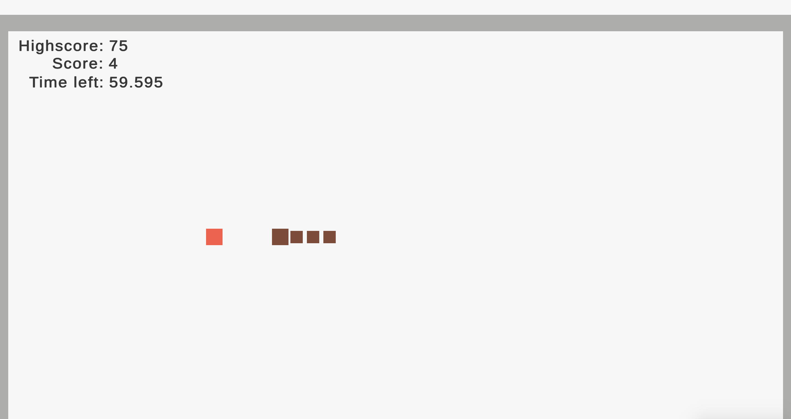
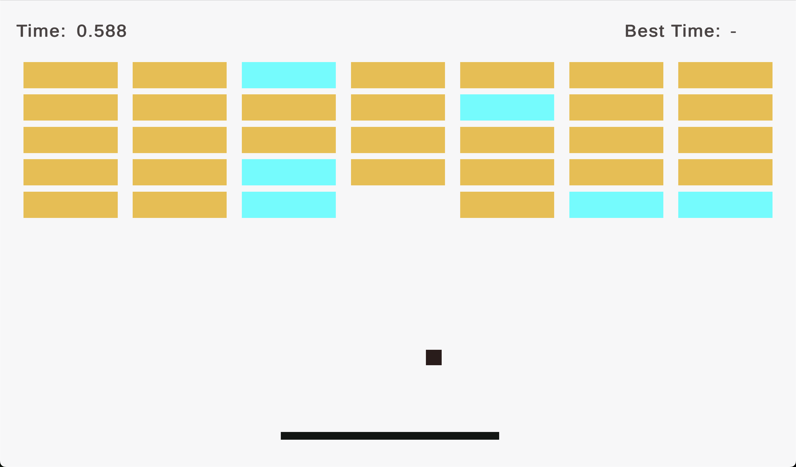

# Detalii proiect
Nume elev: Neagu Ștefan-Claudel  
Profesor îndrumător: Ungureanu Florentina  

# Cuprins
1. [[#Detalii proiect]]
2. [[#Cuprins]]
3. [[#Introducere]]
4. [[#Tehnologii folosite]]
5. [[#Structura proiectului]]
	1. [[#Ecranul Principal]]
	2. [[#Snake]]
		1. [[#Codul pentru creșterea și deplasarea șarpelui]]
	3. [[#Breakout]]
		1. [[#Codul pentru deplasarea mingii]]
6. [[#Posibile îmbunătățiri]]
7. [[#Concluzie]]
8. [[#Bibliografie]]

# Introducere
Din dorința de a învăța limbajul C# și a mă familiariza cu dezvoltarea de jocuri am creat proiectul actual. Acesta prezintă utilizatorului două jocuri bazate pe [Snake](https://en.wikipedia.org/wiki/Snake_(video_game_genre)) și [Breakout](https://en.wikipedia.org/wiki/Breakout_(video_game)), dar cu niște modificări menite să aducă o notă de originalitate și dificultate.

# Tehnologii folosite
Proiectul a fost creat cu ajutorul programului [Unity](https://en.wikipedia.org/wiki/Unity_(game_engine)), care facilitează dezvoltarea de jocuri video. Acesta oferă programatorului librării cu diverse funcții utilitare și o interfață grafică pentru dezvoltarea aplicației.

În Unity, fiecare element din joc este un [`GameObject`](https://docs.unity3d.com/6000.0/Documentation/ScriptReference/GameObject.html), la care se pot adăuga diverse componente responsabile pentru funcționalități legate de simularea fizicii, specificarea dispozitivelor de intrare, stabilirea aspectului unui `GameObject` etc. De asemenea, utilizatorul poate crea propriile sale componente numite `Scripts`, pe care le poate atașa unui `GameObject` la alegere. Acestea sunt scrise în limbajul de programare C#.

Pentru ca un `Script` să poată fi atașat unui `GameObject`, trebuie să aibă declarat o clasă publică ce moștenește metode din `MonoBehaviour`. Clasa astfel formată poate suprascrie anumite metode specifice oferite de Unity. Câteva dintre acestea sunt:
- `Awake`: are rolul de a inițializa instanța actuală a clasei din `Script`
- `Update`: funcția aceasta rulează la fiecare `frame` al jocului
- `FixedUpdate`: de regulă aici este scris codul care se ocupă cu schimbarea vitezei și direcției `GameObject`-ului la care este atașat codul

Dintre componentele care pot fi folosite pe un `GameObject` cele mai utilizate sunt:
- `Transform`: specifică poziția `GameObject`-ului în spațiu
- `Rigidbody2D`: simulează forțe și coliziuni pentru `GameObject`-ul la care este atașat
- `Collider`: definește un contur folosit de `Rigidbody2D` pentru a determina când două obiecte se intersectează

# Structura proiectului
## Ecranul Principal
Când utilizatorul deschide aplicația, este întâmpinat de următorul ecran (denumit Ecran Principal):


Aici sunt prezentate cele două jocuri. Fiecare din ele are un titlu descriptiv, o imagine reprezentativă și o provocare pentru utilizator, pe care acesta poate să o aibă în vedere în timp ce se joacă. Alegerea unui mod de joc se face prin apăsarea pe imaginea reprezentativă acestuia. Jucătorul poate reveni mereu la ecranul principal prin apăsarea tastei *Escape*, localizată de regulă în partea din stânga-sus a tastaturii.

## Snake
Dacă utilizatorul alege să joace Snake, va fi întâmpinat de următorul ecran:



Segmentele maro reprezintă șarpele, o entitate virtuală controlată de către jucător. Acesta se poate mișca în sus (la apăsarea tastei 'W'), în jos (la apăsarea tastei 'S'), la stânga (la apăsarea tastei 'A') sau la dreapta (la apăsarea tastei 'D'). Pătrățica roșie este un item pe care jucătorul îl poate colecta. Obținerea acesteia va modifica lungimea șarpelui.

În stânga sus există 3 statistici de interes:
- **Highscore**: cel mai bun scor pe care l-a obținut jucătorul vreodată. Valoarea aceasta este stocată local cu ajutorul utilității [PlayerPrefs](https://docs.unity3d.com/6000.0/Documentation/ScriptReference/PlayerPrefs.html) prezentă în Unity.
- **Score**: scorul actual al jucătorului. Această valoare este influențată de itemii colectați pe parcurs și este diferită de lungimea șarpelui.
- **Time left**: timpul rămas până când jocul se oprește. Inițial sunt acordate 60 de secunde.

Pe lângă pătrățica roșie, mai există încă doi itemi cu diverse efecte. În poza de mai jos apar toți trei:


**Pătrățica roșie** (numită și **food**) crește lungimea șarpelui cu 1 și scorul cu `_multiplier`, o variabilă privată ce stochează cu cât ar trebui să fie mărit scorul la un moment dat. Inițial `_multiplier` este egal cu 1.

**Pătrățica verde** (numită și **energizer**) mărește viteza de deplasare a șarpelui, făcând jocul mai dificil, dar în același timp crește `_multiplier` cu 2, ceea ce duce la obținerea unui scor mai mare într-un timp mai rapid. Ea va apărea odată ce jucătorul obține un scor mai mare sau egal ca 7.

**Pătrățica vișiniu-închis** (numită și **dagger**) înjumătățește scorul și lungimea șarpelui, dar adaugă un minut la timpul rămas. Aceasta nu schimbă valoarea variabilei `_multiplier`, permițându-i jucătorului să recupereze scorul pierdut și chiar să-l îmbunătățească.

### Codul pentru creșterea și deplasarea șarpelui
Mai jos se află bucățile de cod specifice modificării în lungime a șarpelui (acesta se regăsește în fișierul `Scripts/Snake/SnakeController.cs`, atașat capului șarpelui):

```csharp
public class SnakeController : MonoBehaviour
{
    private List<Transform> _segments;
    public Transform snakeSegmentPrefab;
    public static int initialLength = 3;

    public void Start()
    {
        ...
        InitializeSegments();
    }

    public void Update() { ... }

    public void FixedUpdate() { ... }

    public void OnTriggerEnter2D(Collider2D collider) { ... }

    public void Grow()
    {
        Transform segment = Instantiate(snakeSegmentPrefab);
        segment.position = _segments[_segments.Count - 1].position;
        _segments.Add(segment);
    }

    public void InitializeSegments()
    {
        _segments = new List<Transform> { _transform };
        for (int i = 1; i <= initialLength; i++)
        {
            Transform newSegment = Instantiate(snakeSegmentPrefab).transform;
            newSegment.position = _transform.position - _direction * i; // add segments in the opposite direction
            _segments.Add(newSegment);
        }
    }
}
```

Codul reține o listă de poziții. Fiecare poziție este o referință la diferite segmente din corpul șarpelui. Când jocul pornește, este chemată automat funcția `Start` (similară cu `Awake`), care inițializează șarpele prin metoda `InitializeSegments`. Aceasta adaugă capul în lista de poziții (numită `_segments`), alături de alte câteva segmente în funcție de valoarea variabilei `initialLength`. De fiecare dată când șarpele trebuie să crească, părți ale aplicației vor invoca funcția `Grow` ce va adăuga un nou segment la capătul listei.

## Breakout
Dacă utilizatorul alege să joace Breakout, va fi întâmpinat de un ecran asemănător cu următorul:



Scopul acestui joc este distrugerea peretelui folosind o minge (reprezentată de pixelul maro) într-un timp cât mai scurt. În partea de sus se regăsesc următoarele statistici:
- **Time**: precizează câte secunde au trecut de la începerea jocului
- **Best Time**: prezintă cel mai scurt timp în care jucătorul a spart tot peretele

Peretele este alcătuit din mai multe cărămizi, care pot fi de două tipuri:
- **Cărămizi galbene**: nu au niciun efect special. Odată ce intră în contact cu mingea dispar.
- **Cărămizi albastre**: când intră în contact cu mingea dispar și în locul lor apare o nouă minge

Dificultatea jocului vine în principal din viteza de deplasare a mingii și a multitudinii de interacțiuni dintre aceasta cu alte obiecte. Toți acești factori fac dificilă urmărirea entității și prevenirea acesteia din a părăsi câmpul vizual, lucru care ar duce la resetarea nivelului.

### Codul pentru deplasarea mingii
Din fericire, Unity se ocupă automat de simularea fizicii necesară într-un asemenea joc. Pentru a folosi această caracteristică, a fost nevoie să adaug la minge o componentă de tip [`Rigidbody2D`](https://docs.unity3d.com/6000.0/Documentation/ScriptReference/Rigidbody2D.html) cu setarea `Gravity` oprită (pentru a nu simula forța gravitațională). De asemenea, a fost necesară și crearea unui [`Physic Material`](https://docs.unity3d.com/6000.0/Documentation/Manual/class-PhysicsMaterial.html) cu `Friction` setat la 0 și `Bounciness` setat la 1.

Cu toate acestea, numai cu aceste setări mingea ar rămâne într-un singur loc atunci când jocul pornește. Pentru a repara defectul descris a fost nevoie de atașarea unei componente de tip `Script` pe minge. Câteva secvențe de cod folosite pentru componenta menționată sunt prezentate mai jos (codul complet se regăsește în fișierul `Scripts/Breakout/BallController.cs`):

```csharp
using System;
using UnityEngine;

public class BallController : MonoBehaviour
{
    private Rigidbody2D _rigidBody;
    public float minSpeed = 20;
    public float maxSpeed = 30;
    public Vector3 velocity;

    public void Awake()
    {
        _rigidBody = GetComponent<Rigidbody2D>();
        ...
        _rigidBody.linearVelocity = new(0, -minSpeed);
    }

    public void FixedUpdate()
    {
        _rigidBody.linearVelocity = Utility.ClampMagnitude(_rigidBody.linearVelocity, maxSpeed, minSpeed); 
        
        if (Math.Abs(_rigidBody.linearVelocity.y) < 1)
            _rigidBody.linearVelocity = new(_rigidBody.linearVelocity.x, Math.Sign(_rigidBody.linearVelocity.y));
        velocity = _rigidBody.linearVelocity;

		...
    }
}
```

Funcția `Awake` este în mod automat invocată atunci când jocul pornește. În aceasta aplicăm o forță inițială asupra mingii, care o va face să se deplaseze în jos la începerea jocului:

```csharp
_rigidBody.linearVelocity = new(0, -minSpeed);
```

Cu toate acestea apare o nouă problemă: există situații în care mingea se blochează și începe a se deplasa exclusiv pe axa $Ox$. Aceasta se datorează faptului că în asemenea situații componenta $Oy$ a vitezei este subunitară, creând iluzia lipsei de mișcare pe axa $Oy$. Codul din funcția `FixedUpdate` se ocupă de rezolvarea problemei în discuție prin setarea componentei $Oy$ a vitezei la -1 sau +1 atunci când devine subunitară.

Prima linie din `FixedUpdate` are rolul de a păstra viteza în intervalul `[minSpeed, maxSpeed]`.

# Posibile îmbunătățiri
1. În Snake, s-ar putea modifica codul sursă în așa fel încât lungimea șarpelui să crească cu `_multiplier` în loc să crească constant cu 1. Această modificare ar crește semnificativ dificultatea deoarece jucătorul ar avea de controlat un șarpe mai lung.
2. În Breakout, ar putea fi adăugate mai multe tipuri de cărămizi. Spre exemplu, s-ar putea adăuga una care, în contact cu mingea, distruge cărămizile din jurul ei și pe înseși.
3. Pe măsură ce codul crește în dimensiuni și complexitatea acestuia se va mări. Dat fiind numărul mare de interacțiuni pe care diverse entități din joc vor fi nevoite să le facă, adoptarea unui sistem bazat pe evenimente va fi bine-venită. Astfel, ar putea exista un fișier cu o listă de C# `events` la care componentele din joc se vor putea abona.
4. Dacă performanța jocului va trebui îmbunătățită, proiectul de față ar putea fi portat la [Unreal Engine](https://en.wikipedia.org/wiki/Unreal_Engine), lucru ce mi-ar permite să învăț un nou program.

# Concluzie
În concluzie proiectul prezent se folosește de elemente de bază din programul Unity pentru a crea două jocuri clasice cu elemente de noutate în scop educațional.

# Bibliografie
- [Snake (video game)](https://en.wikipedia.org/wiki/Snake_(video_game_genre))
- [Breakout (video game)](https://en.wikipedia.org/wiki/Breakout_(video_game))
- [GameObject - Unity Documentation](https://docs.unity3d.com/6000.0/Documentation/ScriptReference/GameObject.html)
- [PlayerPrefs - Unity Documentation](https://docs.unity3d.com/6000.0/Documentation/ScriptReference/PlayerPrefs.html)
- [Rigidbody2D - Unity Documentation](https://docs.unity3d.com/6000.0/Documentation/ScriptReference/Rigidbody2D.html)
- [PhysicsMaterial - Unity Documentation](https://docs.unity3d.com/6000.0/Documentation/Manual/class-PhysicsMaterial.html)
- [Unreal Engine](https://en.wikipedia.org/wiki/Unreal_Engine)
- [Snake Tutorial](https://www.youtube.com/watch?v=U8gUnpeaMbQ&t=2621s)
- [Breakout Tutorial](https://www.youtube.com/watch?v=jyXZ3RVe5as&t=1004s)
